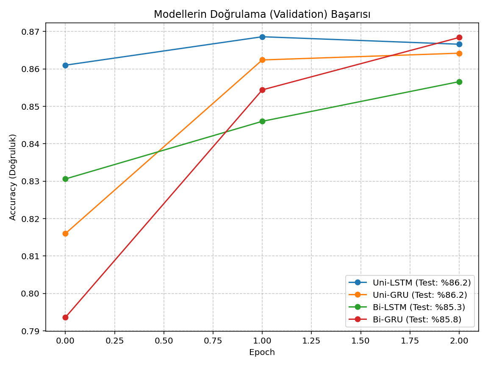
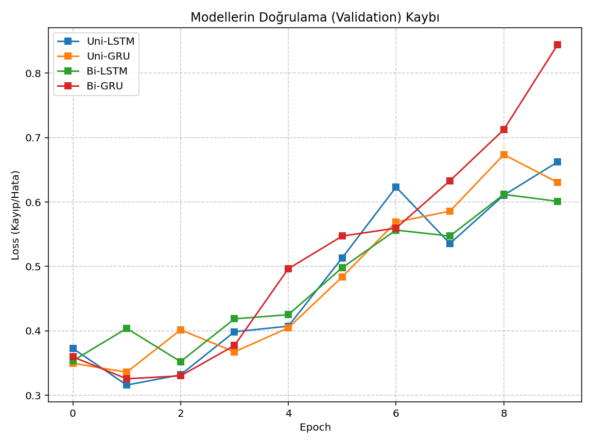
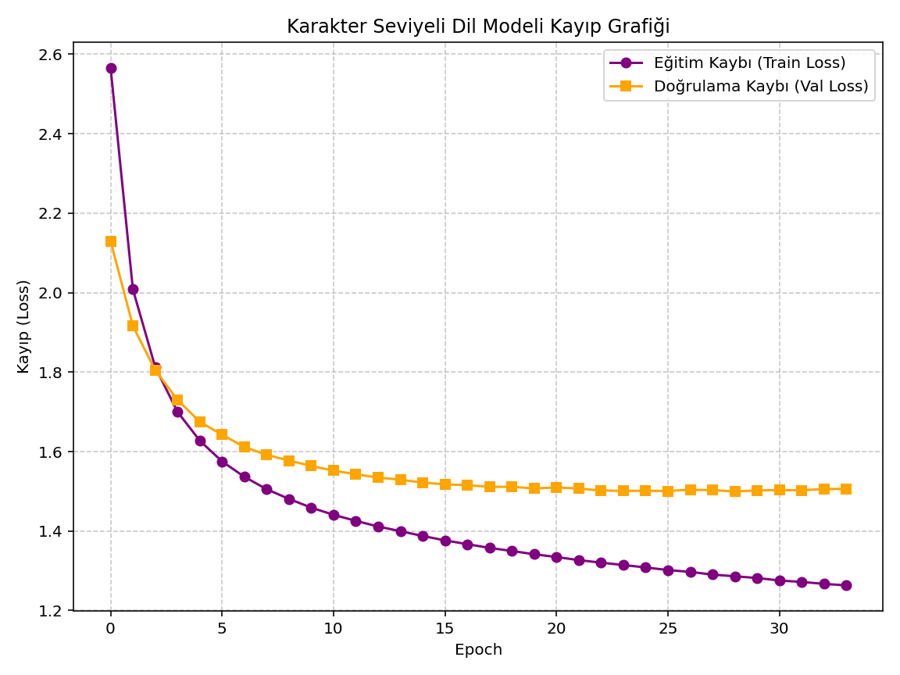

# NLP & RNN Architectures Study: Sentiment Analysis and Character-Level Language Modeling

Bu depo, Doğal Dil İşleme (NLP) ve Tekrarlayan Sinir Ağları (RNN) mimarilerinin yeteneklerini araştıran iki temel projeyi içermektedir. Projelerde LSTM ve GRU hücrelerinin performansları karşılaştırılmış ve karakter seviyesinde metin üretimi gerçekleştirilmiştir.

## 🛠️ Kullanılan Teknolojiler
* **Python 3.x**
* **TensorFlow / Keras** (Model inşası ve eğitimi)
* **NumPy** (Veri manipülasyonu)
* **Matplotlib** (Performans görselleştirmesi)

---

## 📌 Proje 1: IMDB Sentiment Analysis (Duygu Analizi)

Bu projenin amacı, IMDB film eleştirileri veri setini kullanarak metinlerin olumlu (positive) veya olumsuz (negative) olduğunu tahmin eden ikili sınıflandırma (binary classification) modelleri geliştirmektir. 

10 epoch süren eğitim sonucunda modellerin unseen (görülmemiş) test verisi üzerindeki nihai doğruluk oranları şu şekildedir:
* **Uni-LSTM:** %82.72
* **Uni-GRU:** %84.71
* **Bi-LSTM:** %84.98
* **Bi-GRU:** %85.06 🏆

### 📊 Model Performansları ve Karşılaştırma

Aşağıdaki grafiklerde, 4 farklı modelin eğitim süreci boyunca gösterdiği Doğrulama Başarısı (Validation Accuracy) ve Doğrulama Kaybı (Validation Loss) oranlarını görebilirsiniz.


*Şekil 1: Modellerin epoch bazlı doğruluk (accuracy) karşılaştırması.*


*Şekil 2: Modellerin epoch bazlı kayıp (loss) karşılaştırması.*

**Proje Çıktıları ve Analiz:** * Çift yönlü (Bidirectional) modeller bağlamı daha iyi yakalayarak **%85** başarı hedefini aşmış ve en yüksek skoru (Bi-GRU) elde etmiştir.
* GRU hücreleri, bu spesifik veri setinde daha az işlem maliyetiyle LSTM'den daha yüksek doğruluk oranlarına ulaşmıştır.
* Eğitim ve Doğrulama (Validation) eğrileri incelendiğinde, modellerin 3. epoch'tan sonra *overfitting* (ezberleme) eğilimine girdiği gözlemlenmiştir. Bu durum, gelecekteki geliştirmelerde `EarlyStopping` veya daha yüksek `Dropout` oranları kullanılarak optimize edilebilir.

---

## 📌 Proje 2: Character-Level Language Model (Karakter Seviyeli Dil Modeli)

Bu projede Karpathy'nin **Tiny Shakespeare** veri seti kullanılarak karakter seviyesinde bir LSTM dil modeli (Char-RNN) eğitilmiştir. Model kelimeleri değil, harfleri öğrenerek bir sonraki karakteri tahmin etmeye çalışır. Veri seti %90 Eğitim (Train) ve %10 Doğrulama (Validation) olarak ikiye ayrılmıştır.

### 🧠 Mimari ve Optimizasyon
Modelin aşırı öğrenmesini (overfitting) engellemek için Dropout katmanları ve Early Stopping entegre edilmiştir:
* **1x Embedding Katmanı:** Karakterlerin yoğun vektör temsili için.
* **1x Dropout Katmanı (%20):** Ezberlemeyi önlemek için.
* **1x LSTM Katmanı:** 512 birim, stateful yapıda ve %20 recurrent dropout içerir. Sequence takibi için.
* **1x Dropout Katmanı (%20):** Çıktıdan hemen önce özelliklerin rastgele kapatılması için.
* **1x Dense Katmanı:** Vocabulary (Kelime/Karakter dağarcığı) boyutu kadar çıktı üretir.

### 📈 Eğitim Süreci ve Early Stopping
Model, doğrulama kaybını (val_loss) izleyerek eğitilmiştir. Eğitim 34. epoch'ta Early Stopping mekanizması tarafından durdurulmuş ve modelin en iyi performansı gösterdiği **29. epoch**'taki ağırlıkları (val_loss: 1.4996) otomatik olarak geri yüklenmiştir.


*Şekil 3: Karakter seviyeli dil modelinin epoch bazlı eğitim ve doğrulama kaybı.*

### 🎭 Modelden Örnek Çıktılar

Modelin en optimize edilmiş (29. epoch) ağırlıklarıyla, sisteme `"ROMEO: "` başlangıç metni (seed) verilerek aşağıdaki metin üretilmiştir:

> **ROMEO:** how then?
> 
> **CLARENCE:**
> Romeo, your cut off all gentlemen!
> 
> **CORIOLANUS:**
> He will not, sir, it shall not hear thee like.
> 
> **CLIFFORD:**
> No, pardon me.
> 
> **GLOUCESTER:**
> I did the precious love, of your wild my sister
> Is as the mistress of your honour in the day.
> 
> **BRAKENBURY:**
> O men of company, sir.
> 
> **POMPEY:**
> Prove a poor stand way's death, that things content
> To seize on my heart canst not madit me but despite of the order,
> And then the army fools, by such an elphat body
> With love of death shall prove him so.

*(Analiz: Model, kelimelerin harflerden nasıl oluştuğunu öğrenmekle kalmamış; isimleri büyük harfle yazmayı, iki nokta üst üste kullanımını, satır atlamayı ve hatta "thee", "canst" gibi Eski İngilizce tiyatro jargonu kelimelerini kendi kendine inşa etmeyi başarmıştır.)*

---

## 🚀 Kurulum ve Çalıştırma

Projeyi kendi bilgisayarınızda çalıştırmak için:

1. Depoyu klonlayın:
   ```bash
   git clone [https://github.com/KULLANICI_ADINIZ/NLP-RNN-Architectures-Study.git](https://github.com/KULLANICI_ADINIZ/NLP-RNN-Architectures-Study.git)
   cd NLP-RNN-Architectures-Study